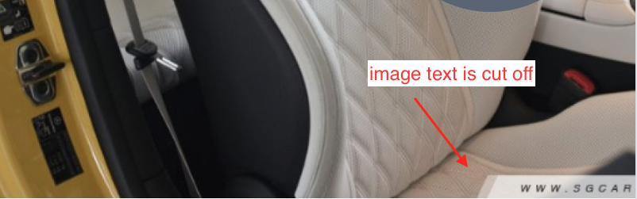

# Changelog 27 February 2025

- [x] Wireframe
- [ ] Body1 (masthead, entry point)
    - [x] layering
    - [x] scroll guide
- [ ] Navigation Hamburger
    - [x] Modal pin top right
    - [x] Expandable
    - [x] Mobile
        - [x] Horizontal Bar
            - [x] `RARROW <- [WA <- IG <- TG <- FB <- TWITTER] <- PIVOT`
        - [x] Icon Color: White
    - [x] Tablet
        - [x] Vertical Bar
      ```
          PIVOT
          -
          WA
          IG
          TG
          FB
          TWITTER
          -
          UARROW
      ```
        - [x] Icon Color: Black
    - [x] Desktop
        - [x] Bar same as Tablet
        - [x] Icon Color: Black

# Changelog 28 February 2025 - 2 March 2025

- [ ] Body2 - First Pitch
    - [ ] Download images and text content
    - [ ] Components (From top to bottom) - Mobile
        - [ ] Container flex
            - [x] Byline
            - [x] Pitch Information
            - [x] Carousel
                - [x] Static Component
                    - [x] Pin to after Pitch Information
                - [x] Animation, Transit on scroll
                - [x] Interaction
                - [x] Margins
                - [ ] Lines
    - [ ] Components (From top to bottom) - Tablet
        - [ ] Container flex
            - [x] Byline
            - [x] Pitch Information
            - [x] Carousel
                - [x] Static Component
                    - [x] Pin to after Pitch Information
                - [x] Animation, Transit on scroll
                - [x] Interaction
                - [x] Margins
                - [ ] Lines
    - [ ] Components (From top to bottom) - Desktop
        - [ ] Container flex
            - [x] Byline
            - [x] Pitch Information
            - [x] Carousel
                - [x] Static Component
                    - [x] Pin to after Pitch Information
                - [x] Animation, Transit on scroll
                - [x] Interaction
                - [x] Margins
                - [ ] Lines
    - [x] Wireframe + add background

# Changelog 28 February 2025 - 2 March 2025

- [ ] Body3 - Pedigree
    - [ ] Mobile
        - [x] Header
        - [x] Content: Porsche
            - [x] Text
            - [x] Image
        - [x] Omit Content: Mercedes
        - [x] BottomGuide
            - [x] Text
            - [x] Animation
    - [x] Tablet
        - [x] Header
        - [x] Content: Porsche
            - [x] Text
            - [x] Image
        - [x] Content: Mercedes
            - [x] Text
            - [x] Image
        - [x] BottomGuide
            - [x] Text
            - [x] Animation
    - [x] Desktop
        - [x] Header
        - [x] Content: Porsche
            - [x] Text
            - [x] Image
        - [x] Content: Mercedes
            - [x] Text
            - [x] Image
        - [x] BottomGuide
            - [x] Text
            - [x] Animation

# Changelog 3 March 2025

- [ ] Body4
    - [ ] Mobile
        - [ ] Header
        - [ ] 1:FrontSeatBackView
            - [ ] background
            - [ ] text
            - [ ] white laser
            - [ ] bubble
        - [ ] 2:FrontSeatFrontView
            - [ ] background
            - [ ] text
            - [ ] white laser
            - [ ] bubble
        - [ ] footer
    - [ ] Tablet
        - [ ] Header
        - [ ] 1:FrontSeatBackView
            - [ ] background
            - [ ] text
            - [ ] white laser
            - [ ] bubble
        - [ ] 2:FrontSeatFrontView
            - [ ] background
            - [ ] text
            - [ ] white laser
            - [ ] bubble
        - [ ] omit footer
    - [ ] Desktop
        - [ ] Header
        - [ ] 1:FrontSeatBackView
            - [ ] background
            - [ ] text
            - [ ] white laser
            - [ ] bubble
        - [ ] 2:FrontSeatFrontView
            - [ ] background
            - [ ] text
            - [ ] white laser
            - [ ] bubble
        - [ ] omit footer

# Issues

- [x] [Issue-0001] [Component] Circle Marker Obstructing Clicks
    - ClassName Ref: `focus-center-circle-mark-wrapper` \
      On `Body2`'s `Carousel`, the circle marker is blocking mouse clicks on Carousel Dots.
      This is due to circle marker having an absolute position.
    - Fixed with `pointer-events: none` on `focus-center-circle-mark-wrapper`

- [x] [Issue-0002] On leaving viewport, animated carousel image dissapears and excessive rerenders.
    - In `Body2`, when at least 50% of the carousel placeholder is in viewport (intersection), the car image scrolls
      in. \
      If the intersection becomes less 50%, the car image dissapears because
      `setStartTransitionStep1(entry.isIntersecting)` restarts animation on leave. looks not very appealing.
    - Fixed with

```
                if (entry.isIntersecting) {
                    setStartTransitionStep1(entry.isIntersecting);
                }
```

- [ ] [Issue-0003] [Component] Lines are not working
    - branch:
      `(body2-carousel-lines)`
    - svg lines are not in the correct position. need to research
        1. how to set starting x an y
        2. calculate x offset L, y offset W, direction
    - Example

```
            (L = 10, W = 0, direction = right)
    (x,y) --------------------------------------------- (x+L,y+W,right)
```

= [ ] [Issue-0006] [Component::Rendering] Same state rerendering

- Component `Body2.Carousel`
- [ ] When the focused item and the next focus item is the same, an unnecessary trigger of `setFocusItem` is executed.
- [ ] TODO, change `items: []ItemData` -> `items: {data: []ItemData, focusIdx: number}`, then check if next focus is the
  same
  as `items.focusIdx`

- [ ] [Issue-0007] [Performace] Large Chunk on Build

when running `pnpm build`, the warning appears:

```
(!) Some chunks are larger than 500 kB after minification. Consider:
- Using dynamic import() to code-split the application
- Use build.rollupOptions.output.manualChunks to improve chunking: https://rollupjs.org/configuration-options/#output-manualchunks
- Adjust chunk size limit for this warning via build.chunkSizeWarningLimit.
```

- [ ] [Issue-0008] [DevOps] pre-commit hook linting continues when error

Sample when execute `./pre-commit`:

Error:

```
/Users/univ/asiaone-technical-assessment/mercedes-frontend/src/layoutComponents/Body4/index.tsx
  83:40  error  'bubbleText' is defined but never used  @typescript-eslint/no-unused-vars

✖ 1 problem (1 error, 0 warnings)

 ELIFECYCLE  Command failed with exit code 1.
```

Commit still success:

```
[body4 7eb538b] body4: big bubble styling
 2 files changed, 85 insertions(+), 33 deletions(-)
 create mode 100644 src/layoutComponents/Body4/index.css
```

- [ ] [Issue-0009] [Component::Display] Image shows partial text

Device Size: Tablet
Page: Body4

